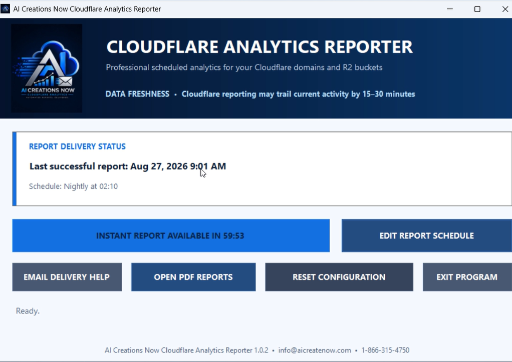

  

<h1 align="center">Cloudflare Analytics Reporter</h1>

**Cloudflare website and R2 delivery reports for Windows.** AI Creations Now Software Development's Reporter creates scheduled and on-demand HTML emails, detailed local PDFs and rolling local history using read-only Cloudflare access.

  <a href="https://aicreatenow.com/cfanalytics.html">Product page and purchase</a>

  

## Features

- Report on up to seven Cloudflare domains and five R2 buckets.
- Review requests, delivered bandwidth, cache usage, HTTP status, paths and available object-level detail.
- Keep the latest available approximately 24-hour view separate from local rolling 30-day history.
- Receive scheduled HTML email summaries and retain detailed PDFs locally for up to 30 days.
- Use a read-only API token, protected locally with Windows DPAPI.

## Requirements and setup

Use a supported 64-bit Windows desktop or Windows Server with Desktop Experience, administrator permission, internet access and an active Cloudflare account. You need your Cloudflare Account ID, a suitable read-only Account API token and an email address for reports.

Activate the application, verify Cloudflare access, select resources and choose your delivery schedule. Website HTTP analytics require Cloudflare-proxied hostnames. R2 reporting is optional and depends on the configured delivery hostname.

Cloudflare data may be delayed or sampled. R2 traffic represents HTTP delivery through the selected hostname, not R2 Operations. Request counts are not counts of unique visitors, completed downloads or completed video plays. Detailed PDFs remain on the licensed computer.

## License, delivery and support

**$39.99 one-time payment** buys a lifetime license for one Windows computer, including lifetime product updates and customer support. This is a purchase-only retail release; older trial references in the demonstration do not apply.

[Buy through the official product page](https://aicreatenow.com/cfanalytics.html). The software package and 10-digit license code are emailed to the checkout address within one hour. The page provides the current [three-day software refund policy](https://aicreatenow.com/cancellation.html#software-refunds).

For delivery, activation or reporting help, email [info@aicreatenow.com](mailto:info@aicreatenow.com).

See [support information](SUPPORT.md) for what to include when requesting help.

## Source and licensing

This repository contains documentation for proprietary software. Application source code is not included. Obtain the application and its applicable terms through the official product page.

AI Creations Now is an independent developer and is not affiliated with or endorsed by Cloudflare or Brevo.

---

Developed by [AI Creations Now Software Development](https://github.com/aicreatenowdom) · [Official software catalog](https://aicreatenow.com/software.html)
